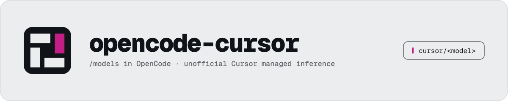

# OpenCode Cursor Inference

<picture>
  <source media="(prefers-color-scheme: dark)" srcset="docs/banner-dark.svg">
  
</picture>

Unofficial OpenCode plugin and AI SDK provider for Cursor managed inference over
`aiserver.v1.InferenceService/RunInference`.

Cursor supplies model inference and routing. OpenCode remains the agent host: it owns the complete
message history, arbitrary tool schemas, tool execution, continuation, sessions, branching,
compaction, and transcript.

> [!WARNING]
> This project is not affiliated with or endorsed by Cursor, Anysphere, or OpenCode. It uses an
> undocumented Cursor service reconstructed from public product evidence. The service can change
> without notice. Review Cursor's terms and your subscription before use.

## Status

Source is public at
[`victor-software-house/opencode-cursor-inference`](https://github.com/victor-software-house/opencode-cursor-inference).
The package is released through a Changesets-managed public npm pipeline with OIDC trusted
publishing.

Verified compatibility target: OpenCode `1.18.27`, Node.js 24 or later, and Bun 1.4 for development.

## Architecture

```text
OpenCode transcript + tools
          |
          v
AI SDK LanguageModelV3 provider
          |
          v
Cursor RunInference over HTTP/2 Connect
          |
          v
text · reasoning · tool-call · usage stream
          |
          v
OpenCode executes tools and continues with results
```

The provider does not execute Cursor-native tools, project MCP servers, shell commands, or an agent
loop. Unsupported request controls and response capabilities fail closed.

## Installation

Add the plugin to `opencode.json`:

```json
{
  "$schema": "https://opencode.ai/config.json",
  "plugin": ["opencode-cursor-inference"]
}
```

Then authenticate:

```sh
opencode auth login
```

Select **Cursor** and complete browser sign-in. OpenCode stores the OAuth credential through its own
auth contract. This package does not maintain a credential database or secret store.

Restart OpenCode after first sign-in so the provider can load the newly discovered model catalog.
Select a model with `/models` or configure it as `cursor/<model-id>`.

## Behavior

- Discovers models by joining Cursor's `AvailableModels`, `GetUsableModels`, and
  `GetDefaultModelForCli` responses.
- Advertises reasoning, images, context limits, and Max mode only when catalog metadata supports
  them.
- Caches only non-secret model metadata under OpenCode's cache directory for ten minutes.
- Derives Cursor's machine identity from the host. A random UUID is persisted in OpenCode's cache
  directory only when host derivation fails.
- Uses OpenCode's `x-session-affinity` or `X-Session-Id` request header as the stable managed-run
  conversation identity.
- Preserves reasoning signatures in AI SDK provider metadata for stateless transcript replay.
- Reuses account-scoped HTTP/2 sessions and closes them when OpenCode disposes the plugin.

## Development

```sh
bun install --frozen-lockfile
mise install --locked
mise run verify
```

`mise run verify` runs generation checks, strict type checking, Biome, oxlint, deterministic unit and
protocol tests, a build, package checks, and an isolated OpenCode `1.18.27` smoke test.

The smoke test:

- creates temporary HOME and XDG directories and removes them automatically;
- loads the built Cursor plugin and a seeded non-secret model cache;
- verifies that OpenCode lists the Cursor fixture model;
- uses a deterministic local fixture provider to emit a `read` tool call;
- proves OpenCode executes the tool and continues with the tool result; and
- never contacts Cursor's inference endpoint.

No live Cursor call is part of the default test suite. Do not add paid or authenticated live calls to
CI.

## Security and privacy

The package sends the complete provider prompt, declared tool schemas, tool results, and supported
image inputs to Cursor for inference. OpenCode executes tool calls locally according to its permission
configuration. Treat both your OpenCode permissions and Cursor account as security boundaries.

Credentials remain in OpenCode's auth store. Tests and fixtures must never contain credentials,
account identifiers, machine identifiers from a real host, billing data, or private source material.

## Scope

The first slice intentionally excludes Cursor `AgentService/Run`, Cursor-native tool execution, MCP
projection, usage dashboards, and host-specific UI. See [decisions](docs/decisions.md) for the durable
boundary and [research](docs/research.md) for evidence classes.

## License

MIT.

See [LICENSE](LICENSE).
